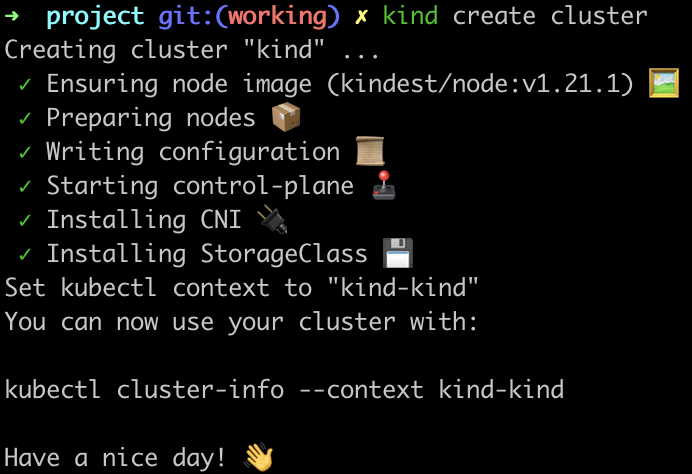
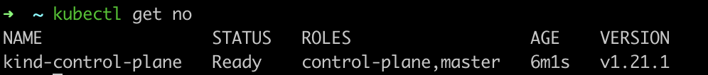
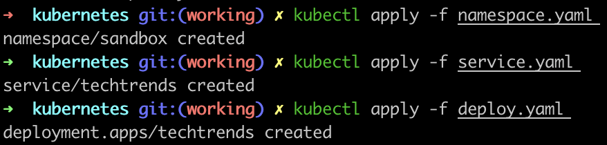
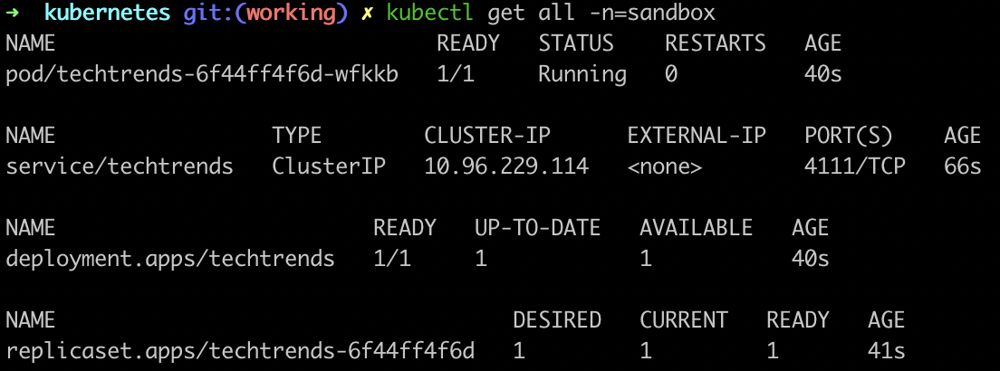
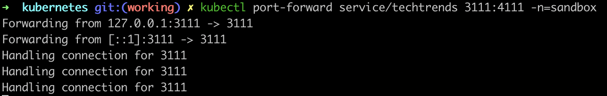
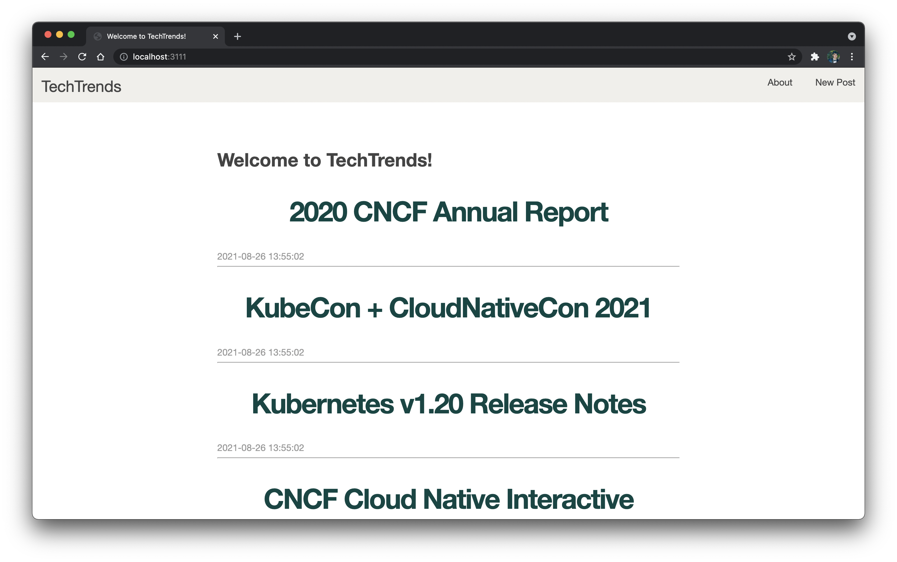

# Project1: SUSE CloudNative Scholarship at Udacity

#### **Introduction**

<p>
This project was submitted as project1 (named: TechTrends) for the SUSE CloudNative Nano Degree at Udacity. Aim of this project was to implement all the different CloudNative tools taught in the first lesson: CloudNative Fundamentals.
</p>

[Link of the Course](https://www.udacity.com/course/cloud-native-application-architecture-nanodegree--nd064)

<p>
This project uses latest CloudNative tools for deploying a blogging app: TechTrends
</p>

<p>
    👨‍💻 Tools used in this project: 👨‍💻 
    <ul>
        <li>Docker</li>
        <li>Kubernetes</li>
        <li>ArgoCD</li>
        <li>Helm</li>
        <li>Vagrant</li>
    </ul>
</p>

<hr>
<br>

#### **Setup Instructions**

<br>

1. Clone this repo onto your machine.

2. Install [Docker](https://docs.docker.com/engine/install/).

3. Install [Kind](https://kind.sigs.k8s.io/). Kind is a [Kubernetes](https://kubernetes.io/docs/concepts/overview/what-is-kubernetes/) bootstrapping tool that would run kubernetes clusters for you in Docker container.

3. To start kubernester cluster:
```
kind create cluster
```

<p align="center">

</p>

4. For checking the running nodes:
```
kubectl get no
```

<p align="center">

</p>

5. For running the app:

    5.1
    ```
    kubect apply -f kubernetes/namespace.yaml
    ```
    5.2
    ```
    kubect apply -f kubernetes/service.yaml
    ```
    5.3
    ```
    kubect apply -f kubernetes/deploy.yaml
    ```

<p align="center">

</p>
<br><br>

For checking the running application:
```
kubectl get all -n=sandbox
```

<p align="center">

</p>

6. For viewing the application in your browser:
```
kubectl port-fowrard service/techtrends 3111:4111 -n=sandbox
```

<p align="center">

</p>
<br><br>

> Note: In place of 3111 your can give any port of your choice. Read more about it at:<br>
https://kubernetes.io/docs/concepts/services-networking/service/ <br>
https://kubernetes.io/docs/tasks/access-application-cluster/port-forward-access-application-cluster/
<br>

Example: 
```
kubectl port-fowrard service/techtrends <your-desired-port>:4111 -n=sandbox
```

7. Type: `localhost:3111` or `localhost:<your-desired-port>` in your browser and your should be able to access the application.

<p align="center">

</p>

Thats all!! 😁 🙌
<br>
> Note: In place of kind your can use any other bootstrapping tools like minikube, k3d, Vagrant with Virtual Box, etc. But the setup instructions would be same from step 5.

<hr>

Developed by [Pranav Singh](https://twitter.com/thebeginner86) ❤️ 👨‍💻
